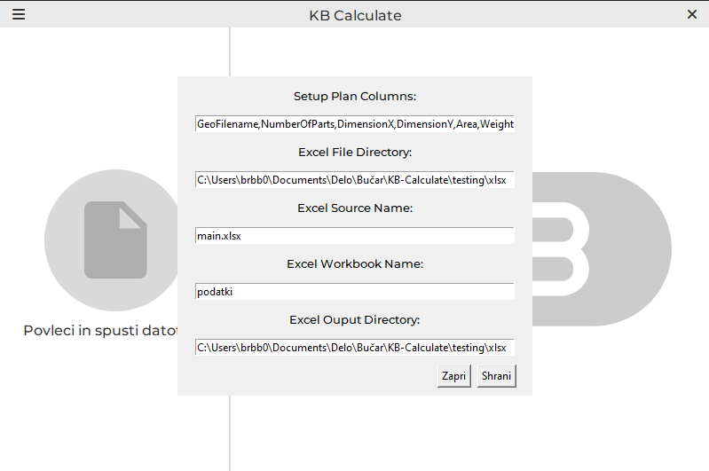
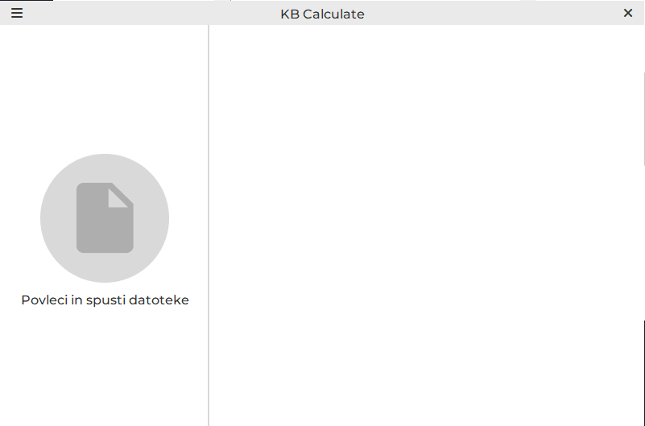
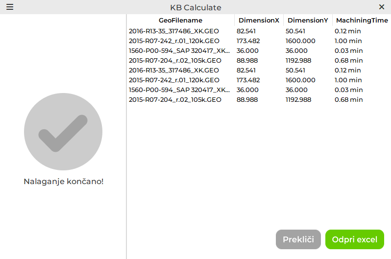

# KB-Calculate

TRUMPF TruTops generates a setup plan containing data such as machining time, blank plate dimensions, weight, cutting length etc. It does this for the whole program run and for each part seperately with a count and machining information for each part.

This is usefeul when calculating prices for each order but you have to manually write out all of the data which takes a long time and is prone to human errors when copying the data.

The KB Calculate program can handle the task of extracting data from the setup plans and arranging it into a Microsoft Excel file.

## Features

* Extract data from multiple setup plan files
* Output file paths can be specified and are named automaticaly acording to the setup plan
* Multiple setup plans are grouped into a single excel file
* Customize which data is extracted
* A main excel file is used which can contain all the formulas for automatic price calculation

## Usage

Create a main excel file which contains the formulas

Set the main file directory, main file name, main sheet name and the directory for output excel files

Drag and drop the setup plans in .HTML format onto the file drop area

Click the open xlsx button to open the created excel file

